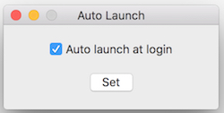
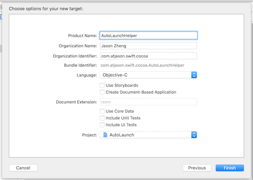
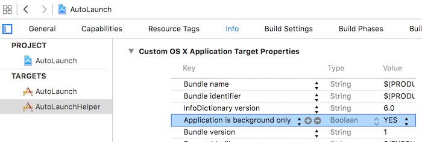
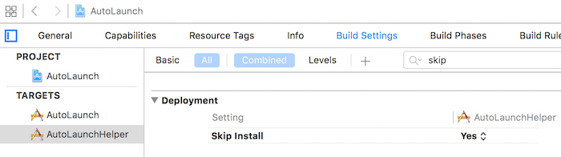
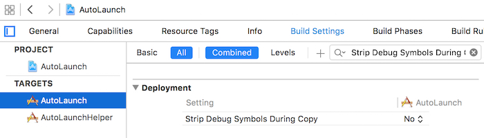
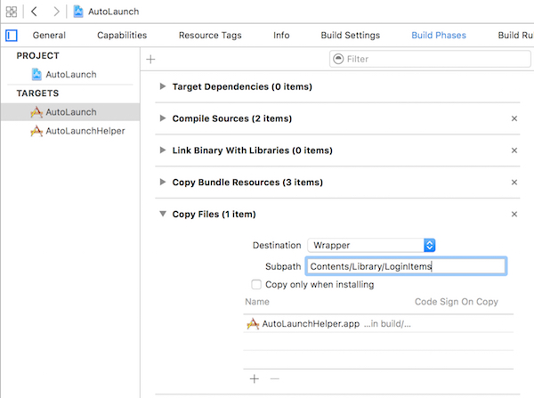

This article is based on this [blog](http://martiancraft.com/blog/2015/01/login-items/). I adjust and implement using Swift.

#Enable ‘launch at login’ in Mac App Store
Beside works in sandbox mode, to enable ‘launch at login’ in Mac App Store, should mee this requirement:
> 2.26 Apps that are set to auto-launch or to have other code automatically run at startup or login without user consent will be rejected.

How to deal with it?
Easy, just add a checkbox in Preferences to let user choose auto launch or not. And, make sure, do **NOT** enable it by default. Otherwise Apple will reject it (I was ever rejected for this reason).



#Steps
The precondition is, you already setup your normal project.

##Add New Target of Helper
Add a new target of your project. You can name the target as "XHelper", and "X" is your main project.
Note: to reduce app's size, choose the Language of 'Objective-C'. No worry, only a few code is needed.



## Settings for Helper Target
Let the helper works in the background and doesn’t display a Dock icon.
Open the **Info** tab for the helper target.
* Under the ‘Custom OS X Application Target Properties’ section, add a new row with the Key ‘**Application is background only**’ and the Boolean value of ‘**YES**’.



Next, let the helper target skips the install when the base application also gets installed. To do this:
Open the **Build Settings** tab for the helper target.
* Search for ‘**Skip Install**’, setting this option to ‘**YES**’



## Settings for Main Target
Open the **Build Settings** tab for the main target.
* Search for the item called ‘**Strip Debug Symbols During Copy**’, and set this item to ‘**NO**’.



Open the **Build Phases** tab for the main target
* If you don’t already have a ‘Copy Files’ phase, then add one by selecting the small + sign in the top left corner of this section.
* Expand the ‘Copy Files’ phase, and select ‘**Wrapper**’ from the Destination drop-down menu
* In the Subpath section, type the following path: "**Contents/Library/LoginItems**"
* Select the + button for the Name section, then search for and add the ‘X Helper.app’ application bundle from the source list that appears, and select it in the list. Click ‘Add’ when done.



This will ensure that the Helper target is copied into our application bundle when we compile the project.

## Code for Helper Target
First, remove the menu and base window in the Helper app’s XIB file.

Open `AppDelegate.m`, add these code in `applicationDidFinishLaunching`. It will find out the path for the main application, launch it, and then terminate itself.
```objectivec
- (void)applicationDidFinishLaunching:(NSNotification *)aNotification {
  NSArray *pathComponents = [[[NSBundle mainBundle] bundlePath] pathComponents];
  pathComponents = [pathComponents subarrayWithRange:NSMakeRange(0, [pathComponents count] - 4)];
  NSString *path = [NSString pathWithComponents:pathComponents];
  [[NSWorkspace sharedWorkspace] launchApplication:path];
  [NSApp terminate:nil];
}
```

## Code for Main Target
There're mainly 2 parts.

### Add Preferences
This is mainly to remember user's choice to auto launch or not. For details, refer to my another [project for Preferences](https://github.com/atjason/CocoaDemoWithSwift/tree/master/Preferences).

### Set Auto Launch
This step is in fact easy. The core is function of `SMLoginItemSetEnabled`. Remember to `import ServiceManagement`.

```swift
import Cocoa
import ServiceManagement

class MainWindowController: NSWindowController {   
  @IBAction func set(sender: NSButton) {    
    let appBundleIdentifier = "com.atjason.swift.cocoa.AutoLaunchHelper"
    let autoLaunch = (autoLaunchCheckbox.state == NSOnState)
    if SMLoginItemSetEnabled(appBundleIdentifier, autoLaunch) {
      if autoLaunch {
        NSLog("Successfully add login item.")
      } else {
        NSLog("Successfully remove login item.")
      }
      
    } else {
      NSLog("Failed to add login item.")
    }
  }
}
```

# Test Auto Launch
In theory, your app and helper should meet these requirements:
* Move the app in the /Applications folder.
* Both the main and Helper application are signed.
* Both the main and Helper application are sandboxed. 

But in fact, when my test app meet none of the requirements above, it still can auto lauch after reboot. Not sure why, but if you plan to release your app in Mac App Store, obviously these requirements will be met. 

Good luck.