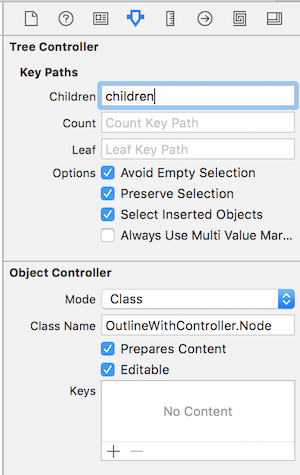
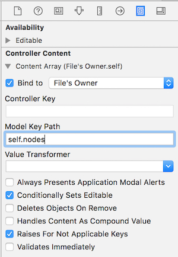
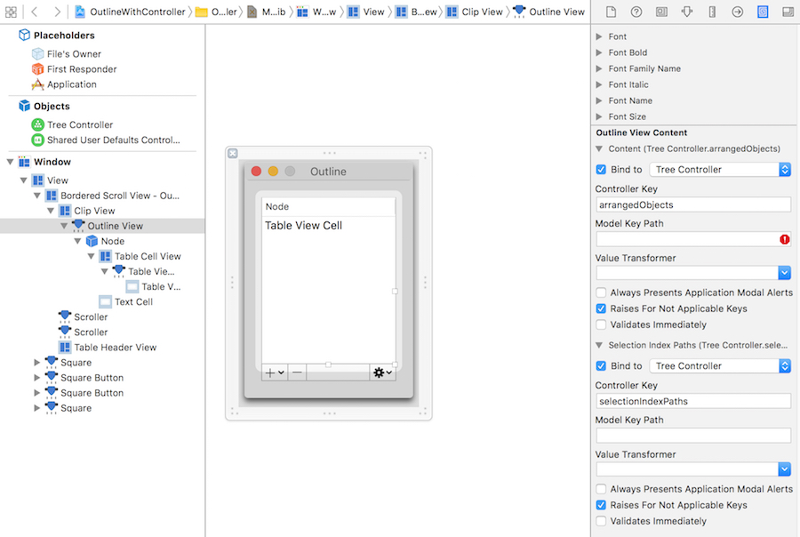
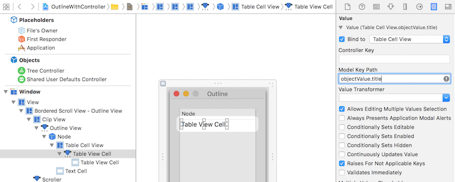
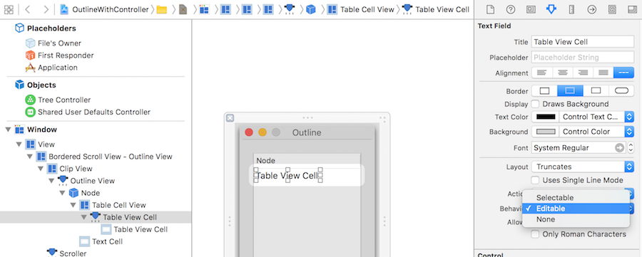
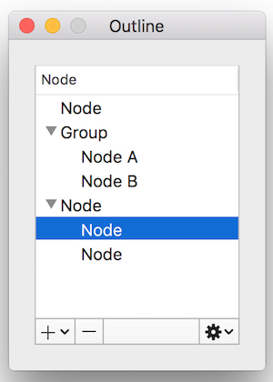

#Steps
##Create Basic Project
Refer to commit till [#40ccec2](https://github.com/atjason/CocoaDemoWithSwift/commit/40ccec2db2584251483fe4dc0b9cc02746aebde3).

##Add UI Controls
Refer to commit till [#2853186](https://github.com/atjason/CocoaDemoWithSwift/commit/2853186db767c0790c1ef3b99de53338818e39c6).
After done, the UI looks like:


##Add Model Class of "Node"
Refer to commit till [#516acc4](https://github.com/atjason/CocoaDemoWithSwift/commit/516acc4b6363a7d28862473ff464c33ef0b17a48).
```swift
class Node: NSObject {
  var title = "Node"
  var children = [Node]()
  
  override init() {
    super.init()
  }

  init(title: String) {
    self.title = title
  }
}
```
## Prepare Demo Nodes Data
Refer to commit till [#f914811](https://github.com/atjason/CocoaDemoWithSwift/commit/f9148114ec25db9a10e654f776396d1b2a2952a0).
Node structure:
\- Node
\- Group
\--- Node A
\--- Node B

##Add and Configure NSTreeController
Refer to commit till [#06b01a8](https://github.com/atjason/CocoaDemoWithSwift/commit/06b01a8ffcbe39dc07403ea74f89b8a8ef420015).
Steps
* Add NSTreeController in the .xib and select it.
* Go to "Attricutes Inspector".
  * Set the "Key Paths > Children" to "children".  
  * Choose "Mode" Class and set "Class Name" to "OutlineWithController.Node".
  * Select "Prepares Content"


* Go to "Binding Inspector".
  * Bind "Content Array" to self.nodes (which was created in previous step).


##Bind NSOutlineView
Refer to commit till [#f941f7b](https://github.com/atjason/CocoaDemoWithSwift/commit/f941f7be8e87ec8d99e67aaae4e059892b56e897).
Steps
* Select "Outline View".
* Go to "Binding Inspector".
  * Bind "Content" to "Tree Controller"'s "arrangedObjects". Ignore the warning in "Model Key Path".
  * Bind "Selection Index Paths" to Tree Controller's "selectionIndexPaths".
 

* Select "Table View Cell".
* Go to "Binding Inspector".
  * Bind "Content" to "Tree Cell View"'s "objectValue.title". Node: here the "objectValue" is the class Node as you defined it in the tree controller.


* Go to "Attributes Inspector".
  * Set "Behavior" to "Editable".


Run the app, you should see the app like:


##Add Node and Remove It
Refer to commit till [#d9b7197](https://github.com/atjason/CocoaDemoWithSwift/commit/d9b71976817eb248db1c19e404e8db16e96187a2).
Steps
* Right click on the tree controller.
* Connect "add:" to "Add Node" menu item.
* Connect "addChild:" to "Add Child Node" menu item.
* Connect "remove:" to edit button.


That's it. Run the app. You should be able to add node or remove it.



##Edit Selected Node
Refer to commit till [#22e2c07](https://github.com/atjason/CocoaDemoWithSwift/commit/22e2c073297d8887b13c97d9030ae5dee30e12c6).
The key code is here:
```swift
  @IBAction func editNode(sender: NSObject) {
    let row = outlineView.selectedRow
    if row != -1 {
      outlineView.editColumn(0, row: row, withEvent: nil, select: true)
    }
  }
```
##Disable Remove and Edit Controls if no Node Selected
Refer to commit till [#eb7decd](https://github.com/atjason/CocoaDemoWithSwift/commit/eb7decdf6a2baeb60f6883e287899ab61d825af8).
The key point is to bind the "Enabled" attribute to tree controller's "canRemove" controller key.
Another point is, when app starts maybe nothing was selected. In this case, disable the Outline's "Attributes > Selection > Empty", and select the Tree Controller's "Attributes > Avoid Empty Selection".
