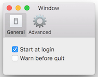
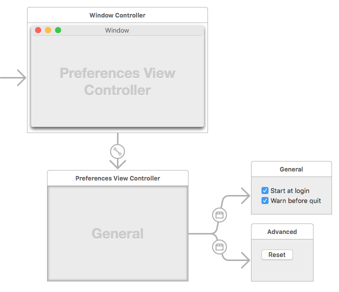
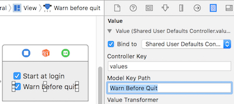

Development environment:
* OS X: 10.11.4
* XCode: 7.3
* Swift: 2.2

After it's finished, the app looks like:



#NSTabViewController
The mainly used class is [`NSTabViewController`](https://developer.apple.com/library/mac/documentation/AppKit/Reference/NSTabViewController_Class/). 
An `NSTabViewController` object is a container view controller that manages a tab view interface, which organizes multiple pages of content but displays only one of those pages at a time. Each page of content is managed by a separate child view controller. Navigation between child view controllers is accomplished with the help of an NSTabView object, which the tab view controller manages. When the user selects a new tab, the tab view controller displays the content associated with the associated child view controller, replacing the previous content.

#Storyboard
Storyboard isn't necessary to build preferences window, but it could let the workflow be clear and simple.



#Preference Manager
Typically there're many settings in preferences. To make it easy to manage all of them, it's better to use one singleton class to access them, e.g., register factory defaults, read, write, reset, etc.

```swift
class PreferenceManager {
  // Single instance
  static let sharedInstance = PreferenceManager()
    
  private init() {
    registerFactoryDefaults()
  }
  
  let userDefaults = NSUserDefaults.standardUserDefaults()
  
  private let initializedKey = "Initialized"
  
  var startAtLogin: Bool {
    get {
      return userDefaults.boolForKey(startAtLoginKey)
    }
    
    set {
      userDefaults.setBool(newValue, forKey: startAtLoginKey)
    }
  }
 
  private func registerFactoryDefaults() {
    let factoryDefaults = [
      initializedKey: NSNumber(bool: false),
    ]
    
    userDefaults.registerDefaults(factoryDefaults)
  }
  
  func synchronize() {
    userDefaults.synchronize()
  }
  
  func reset() {
    userDefaults.removeObjectForKey(initializedKey)    
    synchronize()
  }
}
```

#Bind with User Defaults
Beside using `class PreferenceManager`, you can also directly bind object's value to user defaults.



#Register Factory Defaults
It's better each setting has default value. `NSUserDefaults.registerDefaults` works for it.
**Note**: The contents of the registration domain are not written to disk; you need to call this method each time your application starts. You can place a plist file in the application's Resources directory and call registerDefaults: with the contents that you read in from that file.

#Archive
To store data in user defaults, the object need to support archvie. For key based archive, the class need to conform to `NSCoding`. For more introduction, please refer to [here](https://github.com/atjason/LearnCocoaWithSwift/tree/master/12_Archiving/RaiseMan).

#Store Tab View's Size
If you allow user to resize the size of each tab view, its better to store them in user defaults, and restore when user access preferences window again. But as the structure of `NSSize` doesn't support archive, you need to use a class to archive it.

```swift

class SizeArchiver: NSObject, NSCoding {
  private static let sizeKey = "Size"
  
  var size = NSSize()
  
  var width: CGFloat {
    return size.width
  }
  
  var height: CGFloat {
    return size.height
  }
  
  override init() {
    super.init()
  }
  
  init(size: NSSize) {
    super.init()
    
    self.size = size
  }
  
  // MARK: - NSCoding
  
  required init?(coder aDecoder: NSCoder) {
    super.init()
    
    self.size = aDecoder.decodeSizeForKey(SizeArchiver.sizeKey)
  }
  
  func encodeWithCoder(aCoder: NSCoder) {
    aCoder.encodeSize(self.size, forKey: SizeArchiver.sizeKey)
  }
}
```
