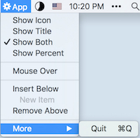
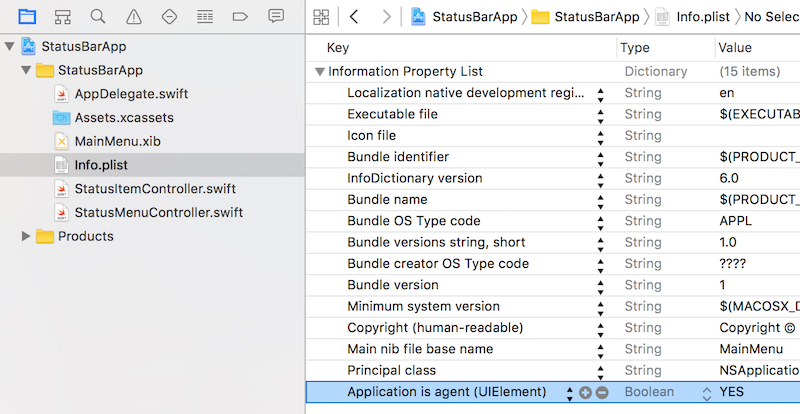
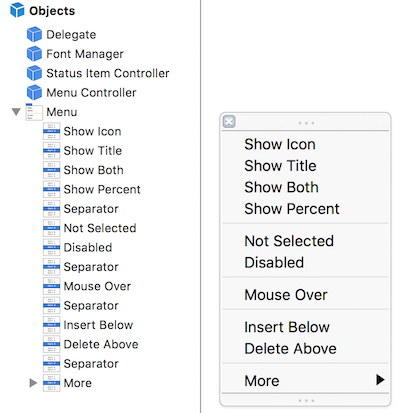
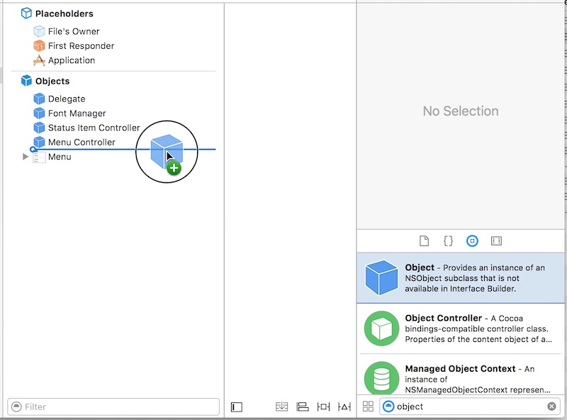
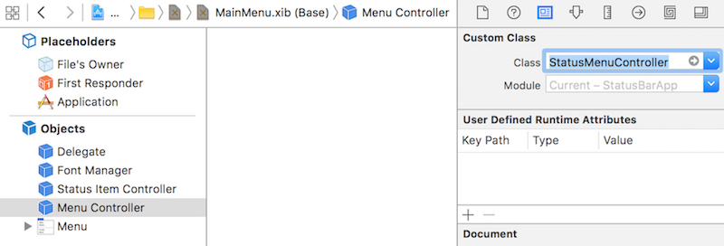
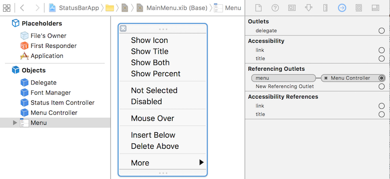
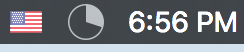
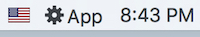
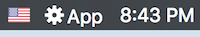
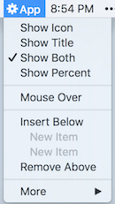

Development environment:
* OS X: 10.11.4
* XCode: 7.3
* Swift: 2.2

After it's finished, the app looks like:



#How to Run as Status Bar App?
In another word, how to make the application not show a dock icon? The key point is to modify the application’s Info.plist file and indicate that it’s an agent. “Agent” is Apple’s term for a background application that doesn’t present a dock icon.
Select the project at the top of the project navigator. Open the Info tab at the top of the main editor. Add a new entry of **Application is agent (UIElement)** and set the value of this entry to YES.



#How to Let Status App Start?
It's better don't write much code in AppDelegate or other single class. To do it, I split main code in these 2 controllers:
1. StatusItemController
This controller is mainly to 'start' the app, i.e., init the status bar item. And also set the menu for status bar item.

2. StatusMenuController
This controller mainly works as the delegate of status bar item's menu. E.g., implement the actions of menu items.

Then, how to let the app start? Steps:
* Open 'MainMenu.xib'.
* Create Menu and sub-menus.



* Add an Object. Set its class to 'StatusMenuController'.





* Add another Object of 'StatusItemController'.
* Connect Menu object to StatusMenuController's 'menu' outlet.



* Connect StatusMenuController to StatusItemController's 'menuController' outlet.


* Open StatusItemController.swift, init the status bar item in 'awakeFromNib'.
```swift
class StatusItemController: NSObject {
  var statusItem: NSStatusItem!
  @IBOutlet weak var menuController: StatusMenuController!  
  override func awakeFromNib() {
    statusItem = NSStatusBar.systemStatusBar()
      .statusItemWithLength(NSVariableStatusItemLength)
    statusItem.title = "App"
    statusItem.highlightMode = true
    statusItem.menu = menuController.menu
  }
}
```

That's it. Now the app should be able to correctly start. As you can see, the key point is, app will init the 'MainMenu.xib' (as defined in Info.plist > 'Main nib file base name'), then all the objects in 'MainMenu.xib" will be created. So, the menu and controllers you added in 'MainMenu.xib" will be created. Clear?

In this case, the AppDelegate could even keep empty. Cool, right?
```swift
@NSApplicationMain
class AppDelegate: NSObject, NSApplicationDelegate {}
```

#How to Show Percent in Status Bar?
There's class of `NSProgressIndicator`. The fact of it is a view. Thus the problem becomes how to add this view to status bar.

You will find, the `NSStatusItem.view` is `nil`, thus you can't add to its subview. From the API of `NSStatusItem` we can found, it's suggested to use `NSStatusItem.button` to customize. OK, we can add view to subviews of the `button`.
```swift
    /// The button that is displayed in the status bar. This is created automatically on the creation of the StatusItem. Behavior customization for the button, such as image, target/action, tooltip, can be set with this property.
    @available(OSX 10.10, *)
    public var button: NSStatusBarButton? { get }
```

That's not finished. Using this code could show the percent in status bar, but the size of status bar item is incorrect. How to deal with it? To be honest, I didn't find a good way, but find a walkaround way, i.e., add an **empty** image to the status bar item. And then add `NSProgressIndicator` to the `button`. It's not good, but works. The code is as following:
```swift
  if let button = statusItem.button {
        // FIXME: it works, but obviously not good.
        let frame = NSRect(x: 6, y: 2, width: 18, height: 18)
        let progressIndicator = NSProgressIndicator(frame: frame)
        progressIndicator.style = .SpinningStyle
        progressIndicator.indeterminate = false
        progressIndicator.doubleValue = 30
        
        // Use empty image to extand the status item's size
        statusItem.image = NSImage(named: "EmptyIconImage")
        button.addSubview(progressIndicator)
  }
``` 
And the percent looks like:




#How to Disable a Menu Item?
It sounds very easy. Just set the `NSMenuItem.enabled = false`. But the fact is not. Read the description for `NSMenuItem.autoenablesItems`:

```swift
    /* Set and get whether the menu autoenables items.  If a menu autoenables items, then calls to -[NSMenuItem setEnabled:] are ignored, and the enabled state is computed via the NSMenuValidation informal protocol below.  Autoenabling is on by default. */
    public var autoenablesItems: Bool
```

As you can see, `NSMenuItem.autoenablesItems` is enabled by default. And if it's enabled, the set of `NSMenuItem.enabled` property will be ignored. Thus, if you want to manually control the `NSMenuItem.enabled` property, first disable the `NSMenuItem.autoenablesItems` property.

#How to Support Dark Mode?
There're 2 key points needed to support dark mode of OS X.
1. The icon itself should support. To be exactly, the background of the icon should be transparent.
2. Set the `NSMenuItem.image?.template = true`

```swift
    /* The 'template' property is metadata that allows clients to be smarter about image processing.  An image should be marked as a template if it is basic glpyh-like black and white art that is intended to be processed into derived images for use on screen.
     
     NSButtonCell applies effects to images based on the state of the button.  For example, images are shaded darker when the button is pressed.  If a template image is set on a cell, the cell can apply more sophisticated effects.  For example, it may be processed into an image that looks engraved when drawn into a cell whose interiorBackgroundStyle is NSBackgroundStyleRaised, like on a textured button.
     */
    
    public var template: Bool
```
The normal and dark status bar items look like:




#How to Support Indentation Level?
Easy. Just set the `NSMenuItem.indentationLevel`.



#How to Pop Over?
It's easy to pop over status item. Check the following code:
```swift
    if let button = statusItem.button {
      popover.showRelativeToRect(button.bounds, ofView: button, preferredEdge: .MinY)
    }
```

But it's hard to pop over menu item, as menu item's view is nil by default. And then no view or bound to show popover relatively. Ever see some other app like [ClipMenu](http://www.clipmenu.com/blog/2014/11/11/clipmenu-1-0-0a1-released/) could implement this feature, but hasn't found how to do it.

Another walkaground is to use `NSMenuItem.toolTip` to show additional information of a menu item.

#What Left?
* tag and representedObject
* action
