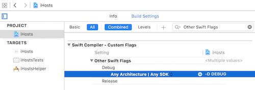

# Set Debug Flag in XCode for Swift

* Open 'Build Settings' for Project (not target)
* Search '**Swift Compiler - Custom Flags**'. Add a `-D DEBUG` entry in `Other Swift Flags`




# Use Debug Flag in Swift

```swift
#if DEBUG
    print("I'm running in DEBUG mode")
#else
    print("I'm running in a non-DEBUG mode")
#endif
```