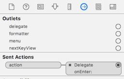
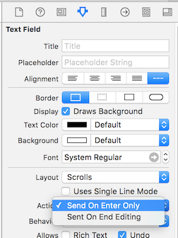

# Add Action in NSTextField's Delegate
```swift
@IBAction func textFieldAction(sender: NSTextField) {
    print(sender.stringValue)
}
```

# Connect NSTextField's Action to Delegate's One



# Set NSTextField's Action Type


